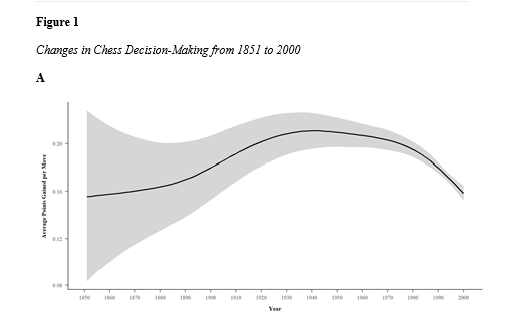
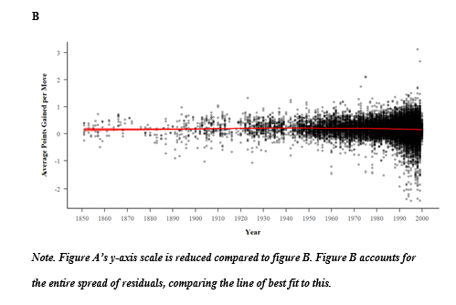
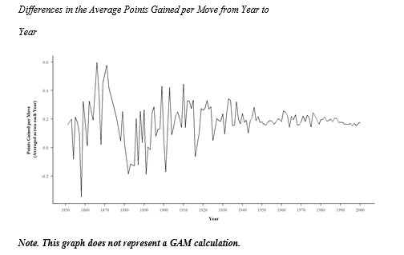
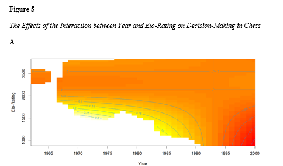
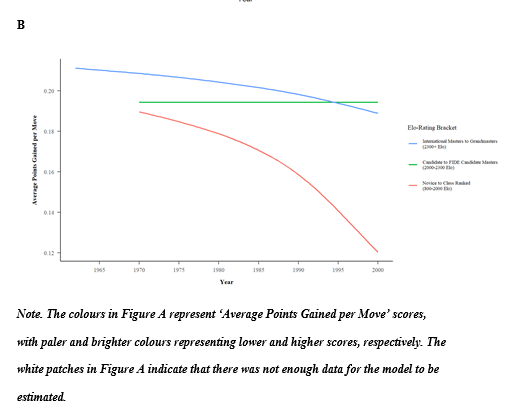

# Project Overview: Has Decision Making in Chess Improved Over the Past Century?
This repository contains all files used in my MSc research project. This project sort to act as a preliminary investigation into the optimal methodologies, and to create scalable data pipelines, for use in a larger scientific project.

The aims of this project were to measure if move selection accuracy had improved within chess players from 1850 to 2000. The chess engine *'Stockfish 15'* was used to evaluate the degree to which each individual move selected by players matched the *'optimal'* move suggested by Stockfish. This 'move accuracy' was then averaged across each player within a game. 

12,000 games were randomly sampled from ChessBase's Mega Database 2022 [(link here)](https://shop.chessbase.com/en/products/mega_database_2022). 

This data was then analysed using a GAM (generalised additive model) to investigate the presumed non-linear relationship between **year** the game was played and **'move accuracy'**, whilst controlling for **Elo-rating** (a player's current proffessional standing). GAMs sit somewhere between traditional linear models and 'black box' machine learning models. GAMs allow for the non-linear modelling of complex data, whilst still maintaining some transparency to the underlying algorithms and explainability of results. A comprehensive explanation of GAMs can be found in this Towards Data Science article [(link here)](https://towardsdatascience.com/generalised-additive-models-6dfbedf1350a).

## How Stockfish Works
Whilst Stockfish can effectively play chess games to an exceptional standard, it is also able to evaluate current board states, by using points to indicate which player currently holds advantage. The evaluation posits that if each player plays perfectly from then on, the current player ahead will remain so by the current points margin, until eventually winning the game.  This means mistakes are the only way to lose points. Therefore, this project measured decision-making accuracy by the average degree each player’s evaluated points advantage decreased after selecting a move. This provided a continuous performance measure that uses the exact same objective benchmark, regardless of period, age, or birth cohort of the player.

## Important Information before Running the Code
The working directory should include all the files and folders in the current repository format. The data pipeline requires heavy computational processing and time to complete, so is not recommended to perform on a personal laptop. This repository's main purpose is to act as an exemplar for the steps taken in the project. 

The working directory should also contain an empty folder titled **'output_data'**. This will be where the output files of the data pipeline are stored.

Ensure the **here()** function is set correctly to your working directory, by first restarting R and then setting the working directory to the source file location. 

## Repository Overview
*loop.R and and analysis.R are to be run consecutively.*

**loop.R:** This is the R code for the data pipeline. It reads in the text files and retrieves the move evaluations from *Stockfish*. It then appends these to the end of a text file in the folder titled **'output_data'**. The file then joins these files back to the input files. This script is scalable to manipulate and process a variety of input files from the chess database.

**analysis.R:** This R script cleans the mined data in preparation for analysis and then formulates the GAM. 

**input_data:** The data that is fed into the data pipeline through the loop.R script. These are text files containing information on a given chess game.

**stockfish_15_x64_avx2.exe:** This is the Stockfish 15 software. A terminal is created between this and R.

## Project Conclusions
Small but significant non-linear changes in decision making over time were revelaed. Contrary to previous studies, decision-making was found to have been increasing in accuracy until 1940, before subsequently decreasing. 

Visualisations of this small non-linear change can be found below. These are taken from the submitted scientific research paper.

Interestingly the variation in the average points gained per move has decreased over time, suggesting modern players may have a more standardised, similar way of playing across games.

## Project Limitations
There is uncertainty over whether the discrepancy to the previous studies was due to the current sample’s lower skill level, as interactions between Elo-rating and time revealed conflicting results on whether lower skilled players in the sample experienced stronger decline in decision-making. 

These results are visualised below as screenshots of the graphs submitted in the final paper. Graph B's legend shows blue has highly ranked players, green as moderatly ranked players and red as lowly ranked players, according to arbitary groups used simply for illustrative purposes.

It is suggested these results are better explained by methodological limitations in the measurement of decision-making as the Stockfish software may have erronously not 'banked' a points reduction after a player's mistake until their opponent capitalises on the mistake. Therefore, future research should instead focus on the variance of Stockfish evaluation scores within a given game whereby high fluctuations would suggest a higher degree of mistakes were made from the two players in that game.
